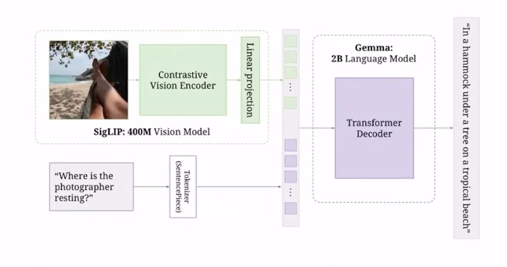

# 🦙 PaliGemma — Vision-Language Model (VLM) Implementation & Explanation

This repository contains a **fully-working re-implementation** of **PaliGemma** paper, Google’s **Vision-Language Model (VLM)** that combines:

- **Gemma (Large Language Model)** for autoregressive text generation  
- **SigLIP (Vision Encoder)** for extracting rich visual features

---

## This document provides a **technical deep dive** into the architecture, covering:

- Vision encoder details (Convolution, Learnable Positional Embeddings, Multi-Head Attention, Layer Norm, MLP, etc.)  
- Language decoder details (Embeddings, RoPE, Group-Query Attention, KV-Cache, RMSNorm, Gemma-MLP, Tie Weights, etc.)  
- Multimodal projection and embedding fusion  
- Autoregressive inference flow with example images and diagrams 

---

---

## Model Overview

PaliGemma is a **vision-language model (VLM)** composed of:

1. A **SigLIP** vision encoder (ViT-style transformer)  
2. A **linear projection layer** to align visual embeddings with the language space  
3. A **Gemma** decoder (autoregressive Transformer)  

It takes both an image and text prompt as input, fuses them in embedding space, and produces text output (e.g., caption, question-answer, or reasoning). According to Google’s model card, the decoder is initialized from **Gemma-2B** and the vision encoder is SigLIP‑So400m. :contentReference[oaicite:1]{index=1}  

---
